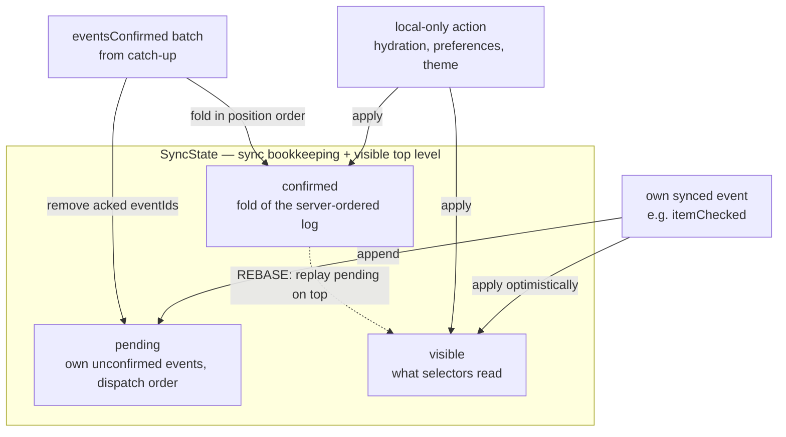
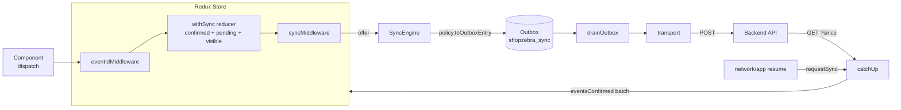
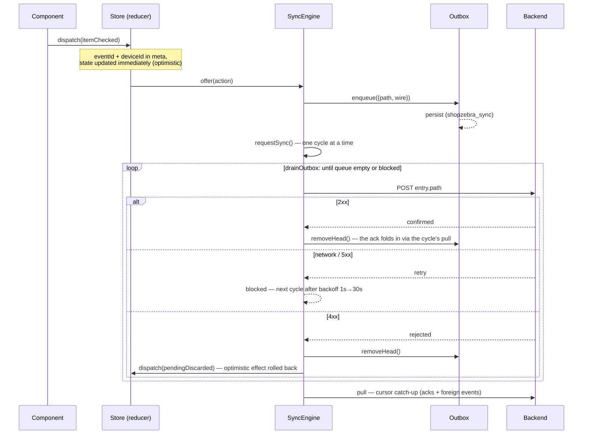
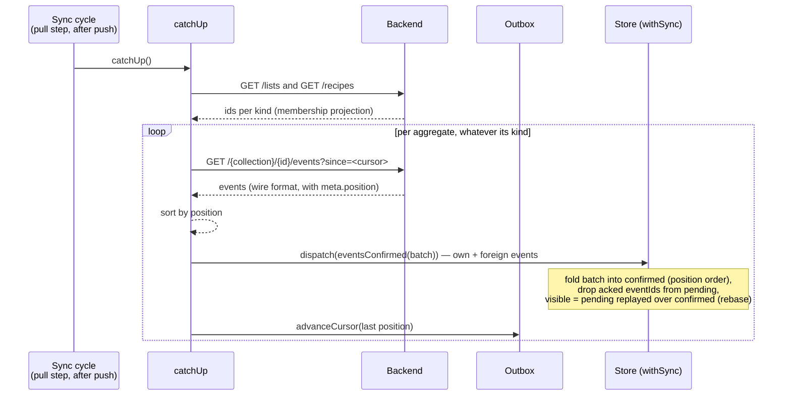
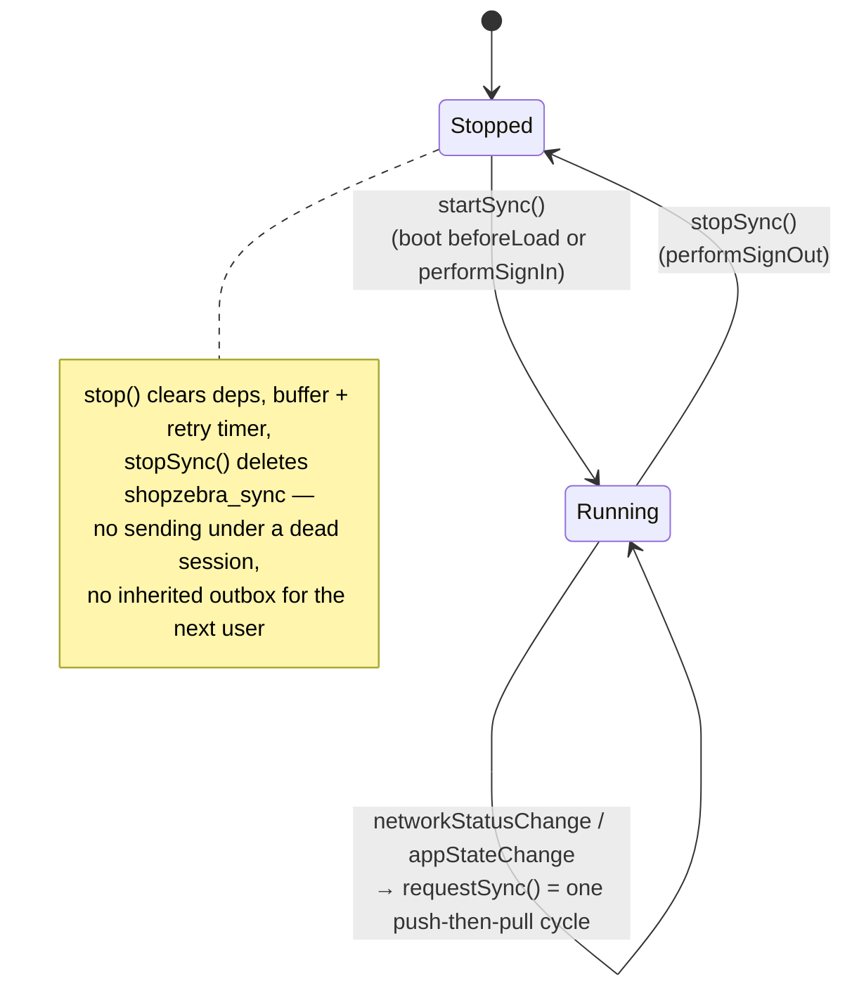

# Sync Engine — Implementation

This directory contains the client side of the sync engine: outbox, cursor catch-up, retry, and the `withSync` rebase. Real-time receive via AppSync does not exist yet — the cursor catch-up is the only receive path. (Historical note: `status.md` calls the outbox/cursor/retry part "Stufe 1" and the rebase "Stufe 2"; this README uses those words only where it refers to that history.)

The whole mechanism in one line — implemented by `withSync.ts`:

```
visibleState = fold(rootReducer, fold(rootReducer, confirmed, serverLog), pending)
```

Stage 1 moves events reliably (outbox + retry out, cursor catch-up in); stage 2 keeps two trees — `confirmed` (fold of the server-ordered log) and `visible` (confirmed + own pending events replayed on top). When a confirmation batch arrives, it folds into `confirmed` at server order and the remaining pending events replay on top: the rebase, one line — `pending.reduce(rootReducer, confirmed)`. All devices fold the same log in the same position order, so they converge by construction.

---

## Core principle

Conflicts are **not** merged on the client. On append, the server assigns a strictly increasing, gapless **position per list** (aggregate); all clients fold the events in exactly that order. Convergence holds by construction, not by merge rules — no CRDTs, no field versions, no last-writer-wins clocks.

The engine exploits the project's central uniformity: **Redux action = domain event = wire format.** A `{ type, payload, meta }` goes over the wire unchanged. There is no mapping layer — which is why a new event type costs **close to zero lines of sync code**: `synced: true` on the slice, plus declaring the reducer (`role: 'event'` with `on`/`opens`, or `localEvent | observation | hydration`, see `app/createSlice.ts`). Still no `if` in the sync path — the composed policy looks it up.

---

## The two trees — how the rebase works (`withSync`)

The store keeps two trees plus the pending queue. Every action reaches them in one of three ways:



Local-only actions go to **both** trees on purpose: `visible` is recomputed from `confirmed + pending` on every rebase — anything that only reached `visible` would be erased by the next confirmation.

Worked example — two devices edit the same quantity concurrently; the server orders Mama's event first (position 07), Papa's second (08):

```
                     Papa's device              Mama's device
own dispatch         visible 2, pending [2]     visible 5, pending [5]
                       (confirmed still empty on both — devices DISAGREE)

eventsConfirmed([qty 5 @07, qty 2 @08])   ← same batch on both devices
  fold into confirmed:   fold(5, then 2) = 2    fold(5, then 2) = 2
  acked → pending:       []                     []
  rebase visible:        2                      2   ✓ CONVERGED
```

Without the rebase each device would keep folding in its own arrival order — Papa would end at 5, Mama at 2, permanently. That silent divergence is exactly what stage 2 removes.

---

## Two paths, one bridge

The folder structure mirrors the architecture: `send/` is the write path, `receive/` is the read path, and everything at root level belongs to **both** paths — above all the outbox as the deliberately shared bridge. What each file does is documented in its own header.

Outside this folder, but part of the mechanism:

- **`app/store.ts`** — wires `withSync` around the combined feature reducers. The visible tree stays at top level (`state.lists` etc. — every selector, middleware and `getState()` caller reads it unchanged); `confirmed` and `pending` live under `state.sync`. `sync` is a reserved top-level key.
- **`app/syncMiddleware.ts`** — a single effect: every dispatched action is offered to `syncEngine.offer()`. No per-feature handlers, no `if` chains.
- **`app/eventIdMiddleware.ts`** — stamps `eventId` + `deviceId` **before** the reducer. Actions with `meta.remote` keep their identity (otherwise dedup and ack matching would break).
- **`app/createSlice.ts`** — `synced: true` on a slice forces every one of its reducers to declare itself (`role`, and for events `on`/`opens` naming the aggregate — the compiler checks the payload carries its id). The slice returns these `declarations`; `app/sync/appSyncPolicy.ts` composes them into the one `SyncPolicy` (`reachesServer`, `toOutboxEntry`, `domainActionOf`) that `withSync`, the engine and the receive path consume.
- **Class-2 commands and their events** — invites, join, add/remove member are direct fetches in `features/sharing/memberCommands.ts`, because their answer is needed *before* anything can be shown; the events they cause (`lists/listMemberAdded`, `lists/listMemberRemoved`, and their `recipes/…` counterparts) are written by the server, arrive **only** through catch-up and never travel the outbox. The optimistic rows shown on the tap come from `localEvent` actions (`listMemberAddedLocally`, …), never from a faked server echo.
- **`features/*/domain/*ClientStorageHandler.ts`** (lists, shopping) — persist the **confirmed** tree on every `eventsConfirmed`. Optimistic events are not persisted there; they survive restarts via the outbox queue + `pendingRestored`.



---

## Send path: dispatch → outbox → server

1. A component dispatches an ordinary action (e.g. `shopping/itemChecked`).
2. `eventIdMiddleware` stamps `eventId` (idempotency) and `deviceId` into `meta`.
3. The `withSync` reducer applies it **immediately** to `visible` and appends it to `pending` — optimistic, the UI never waits for the server. `confirmed` stays untouched until the server orders the event.
4. `syncMiddleware` hands the action to `syncEngine.offer()`.
5. `policy.toOutboxEntry()` decides the routing at enqueue time — every entry is uniformly `{ path, wire }`: `meta.remote` or a role other than `event` → `null`; `on: 'list'` → `{ path: '/lists/{listId}/events', wire: action }`; `opens: 'list'` → `{ path: '/lists', wire }` with `ownerId → createdBy`. An event that could not be routed does not exist — the declaration's type demands the id field.
6. The outbox appends the entry and persists; `requestSync()` is kicked — the engine runs one push-then-pull cycle.
7. Inside the cycle, `drainOutbox()` POSTs head-by-head via `sendEntry()`. Response classification:

| Result | Meaning | Reaction |
|---|---|---|
| 2xx `confirmed` | server appended (or deduped via `eventId`) | head leaves the queue; the cycle's pull right after folds the event into `confirmed` at its server position |
| network error / 5xx `retry` | transient | head stays, drain reports `blocked` — the engine runs another cycle after backoff `min(1s·2ⁿ, 30s)` |
| 4xx `rejected` | rejected on merit (envelope, membership, schema) | head is **dropped for good** — the drain reports it, the engine dispatches `pendingDiscarded` and the optimistic effect rolls back out of `visible`, so the UI reflects server truth |



The cycle is **single-flight**: there is never more than one cycle (and thus one send) in flight — the per-aggregate order stays preserved, and triggers arriving mid-cycle coalesce into exactly one follow-up cycle. Retrying is safe because the server dedupes on `meta.eventId` — a lost ack leads at most to a resend, never to a duplicate log entry.

---

## Receive path: cursor catch-up

There is **no push subscription**. The receive path is exclusively the cursor catch-up, and it is not triggered on its own: it is the **pull step of every sync cycle**, running right after the push. Whatever fires `requestSync()` — a recorded action, boot, sign-in, reconnect, resume, the retry timer — ends in a pull. Pull-after-push is what makes acks prompt: the own POST is confirmed before the GET reads the log, so the response reliably contains the just-delivered events along with everything foreign (quasi-realtime while both sides are actively editing). The cycle is linear and runs once, so there is no feedback loop by construction. (This stays true once AppSync lands: a subscription is only ever another `requestSync()` trigger — the cursor remains the reliable path, since mobile OSes kill background connections and reconnect catch-up is mandatory anyway.)



Three things here are built this way on purpose:

- **Own events are fetched and folded like everyone else's.** Only that way do they enter `confirmed` at their *server* position — the source of convergence. There is no skip list: the reducer removes them from `pending` by `eventId` in the same step, so nothing double-applies. (`meta.remote: true` on the batched events still stops any echo through the middleware.)
- **The cursor advances only during catch-up, never on ack.** Foreign events may sit between the own cursor and the position of the own confirmed event — if the ack set the cursor, they would never be fetched.
- **No wipe-and-refold.** Local state stays on screen, only the delta behind the cursor folds in on top. Boot is local-first: hydration renders immediately, catch-up runs in the background (`initialSyncCompleted` drives the skeleton cards on fresh devices).

---

## Persistence

Durable sync state is split by ownership:

```jsonc
// shopzebra_sync (Outbox blob)
{
  "queue":              [ /* OutboxEntry[]: { path, wire } — unacked sends */ ],
  // last confirmed position per aggregate, keyed "<kind>:<id>" — two kinds
  // may hand out the same id and must never share a cursor
  "cursorByAggregate":  { "list:abc": "0000000042", "recipe:bolo": "0000000007" }
}
// shopzebra_lists / shopzebra_shopping (storage handlers)
//   → the CONFIRMED tree, written on every eventsConfirmed
```

The restart round-trip: hydration loads the confirmed blobs into both trees (hydration actions are non-synced, so they apply to `confirmed` and `visible` alike) → `SyncEngine.start()` dispatches `pendingRestored` with the queue's wire actions (translated back to domain form via `policy.domainActionOf`) → the rebase replays them on top. Offline edits survive restarts without ever persisting the optimistic tree.

The `Outbox` class holds its state as an immutable value and serializes writes through a `lastWrite` promise chain — no write overtakes another. A corrupted blob parses to `EMPTY` instead of crashing.

Actions dispatched **before** `start()` has loaded the blob land in the engine's `preStartBuffer` and are enqueued at start — nothing is lost between first render and engine start.

---

## Lifecycle



- `startSync()` is idempotent (`started` guard) — the boot `beforeLoad` and an in-session sign-in may both call it, the engine starts exactly once per session. The guard also absorbs React StrictMode double-invocations.
- The Capacitor listeners are registered **at most once per app lifetime** (`listenersRegistered`), no matter how often the engine is started/stopped — otherwise listeners would stack on every sign-in/out cycle.
- `stopSync()` (on sign-out) stops the engine **first** and then deletes the persisted blob — on a shared device, the next user inherits neither queue nor cursor.

---

## Invariants the engine relies on

These hold project-wide; the engine breaks without them:

- **Reducers are replay-pure.** No `Date.now()`, `crypto.randomUUID()`, `Math.random()` inside a reducer — ids/timestamps are created in the middleware and travel in `meta`/`payload`. The stage-2 rebase folds repeatedly; every replay must be identical.
- **Reducers are total.** An inapplicable event is ignored, never thrown — the log is immutable, and a fold that crashes would break the aggregate for every device permanently.
- **Intention events, no full-state events.** `listRenamed` instead of `listUpdated { name, … }` — full-state clobbers during rebase.
- **Class 2 never goes through the event append.** Anything with a cross-user invariant (invites, join, add/remove member) goes through dedicated command endpoints; the server writes those events, the client never appends them. `listCreated`/`recipeCreated` are *not* class 2 — they are class-1 events that open a log: they declare `opens`, and the composed policy routes them to the collection endpoint (`POST /lists` / `POST /recipes`), where the server bootstraps ownership and appends the client's event verbatim. There are no per-action exceptions in the send path: the declaration decides the route, like for any other event.

---

## Resolved by stage 2

Three of the former stage-1 limits are gone structurally:

- **Order divergence on concurrent edits** — the rebase folds everyone's events in server-position order; devices converge by construction.
- **Race between push and pull** — gone structurally: both are sequential steps of the same cycle, and folding into `confirmed` plus removing from `pending` happen in one atomic reducer step anyway.
- **Silent 4xx effects** — a rejected event's optimistic effect is now rolled back out of `visible` (`pendingDiscarded`); the UI reflects server truth.

## Known limits

1. **Crash window between confirmed-persist and cursor-persist.** The confirmed blobs (storage handlers) and the cursor (outbox) are written independently and fire-and-forget. A crash in between can refetch and re-fold one list's tail into `confirmed` (harmless for id-idempotent events like `listCreated`; `itemAdded` merges quantities by design — a double fold doubles the quantity). Reducers being total keeps this from ever crashing a fold.
2. **The offline winner is "last sync wins"**, not "last edit wins": an offline edit from 2 pm beats an online edit from 3 pm if it syncs at 4 pm. A deliberate trade-off — for concurrent offline edits no true causal order exists, any choice is arbitrary, and the wrong value is visible and one tap away from being fixed.
3. **No real-time receive.** A passively watching device sees changes only on the next lifecycle trigger (resume/reconnect); only actively editing devices pull with every own cycle. AppSync is not connected yet (the backend's `EventPublisher` is a noop).
4. **Visible jump on rebase.** When a foreign event slides under own pending events, the UI can visibly reorder — a known, accepted cost of the design, as are the two state trees in memory.
5. **No user notification for discarded events.** The rollback is silent; whether to surface "your offline change was rejected" is an open UX question.

## What comes next

Planned order: property tests (convergence, rebase, ack/dedup, totality — the withSync unit tests cover the core scenarios, property tests would generalize them) → snapshots (the client uploads `fold(log)` as an opaque blob, new devices boot from snapshot + tail) → AppSync real-time receive.
